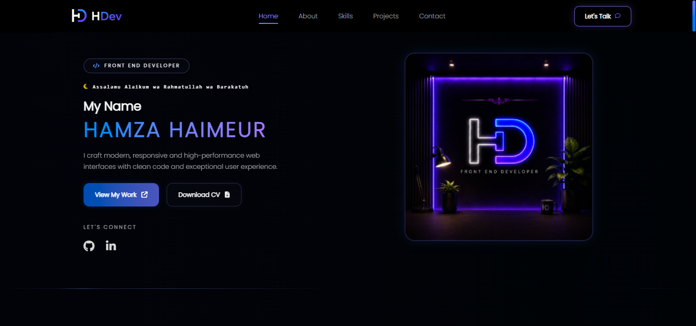

# HDev — Hamza Haimeur Portfolio

Personal portfolio of **Hamza Haimeur**, a Front-End Developer — built with TanStack Start, TypeScript, React 19, and Tailwind CSS.



## ✨ Features

- **TanStack Start (SSR)** — file-based routing with `@tanstack/react-router`
- **Type-safe** end to end with TypeScript
- **Tailwind CSS v4** with a design system built on shadcn/ui + Radix primitives
- **Dynamic project pages** (`/projects/$slug`) generated from a single data source
- **SEO-ready** — per-page `<title>`/`<meta description>`, Open Graph and Twitter Card tags so shared links render a rich preview (icon, title, description, image)
- **Custom app icon set** — favicon, Apple touch icon, Android/PWA icons, and web manifest
- **Resilient SSR error handling** — a small server wrapper (`src/server.ts`) recovers readable error pages instead of blank 500s

## 🧱 Tech stack

| Layer      | Choice                                             |
| ---------- | --------------------------------------------------- |
| Framework  | TanStack Start + TanStack Router                     |
| Language   | TypeScript                                           |
| UI         | React 19, Tailwind CSS 4, shadcn/ui, Radix UI, lucide-react |
| Forms      | React Hook Form + Zod                                |
| Data/state | TanStack Query                                       |
| Tooling    | Vite, ESLint, Prettier                               |

## 📁 Project structure

```
public/                  Static assets served as-is (favicons, manifest, images, fonts, CV)
src/
  components/
    layout/              Header, footer
    project/             Project detail page building blocks
    sections/            Home page sections (Hero, About, Skills, Projects, Contact)
    ui/                  shadcn/ui primitives
  data/projects.ts        Single source of truth for all project content
  lib/
    site-config.ts         Nav links, social links, site URL & default OG image
    utils.ts                Shared helpers (cn, etc.)
    error-capture.ts         Recovers the original error for the SSR error page
    error-page.ts            Fallback HTML rendered on unhandled server errors
  routes/
    __root.tsx             App shell: global <head> (meta, icons, OG/Twitter tags)
    index.tsx               Home page
    projects.$slug.tsx      Dynamic project page (per-project SEO + OG image)
  server.ts                 SSR entry wrapper with error recovery
  styles.css                 Tailwind + design tokens (oklch color palette)
```

## 🚀 Getting started

Requires Node.js 18+ (or Bun).

```bash
git clone <this-repository-url>
cd hdev-portfolio
npm install
npm run dev
```

Other scripts:

```bash
npm run build       # production build
npm run preview     # preview the production build locally
npm run lint         # run ESLint
npm run format       # format with Prettier
```

## 🔗 Link previews (Open Graph / Twitter Cards)

When the site's link is shared (WhatsApp, Twitter/X, LinkedIn, Discord, etc.) it renders a card with the site icon, title, description and a preview image, powered by the meta tags in `src/routes/__root.tsx` and overridden per page in `index.tsx` / `projects.$slug.tsx`.

**Before deploying**, update `SITE_URL` in `src/lib/site-config.ts` with your real production domain — some platforms (e.g. LinkedIn) require an **absolute** image URL to display the preview correctly:

```ts
export const SITE_URL = "https://your-real-domain.com";
```

## 🖼️ App icons

All favicons/app icons (`favicon.ico`, `favicon-16x16.png`, `favicon-32x32.png`, `apple-touch-icon.png`, `android-chrome-192x192.png`, `android-chrome-512x512.png`, `site.webmanifest`) live in `public/` and are generated from the HD brand mark. To update the icon in the future, regenerate this set from a new square source image and replace these files.

## 📄 License

This project is personal portfolio code. Feel free to use it as a learning reference; please don't republish it as-is under your own name.
